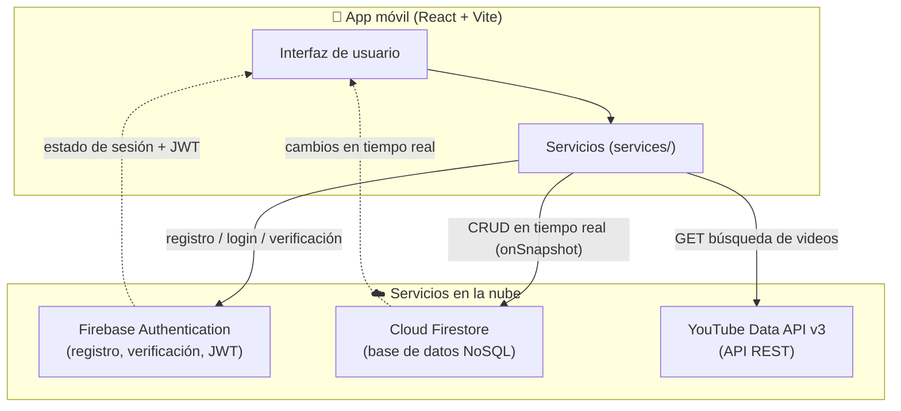
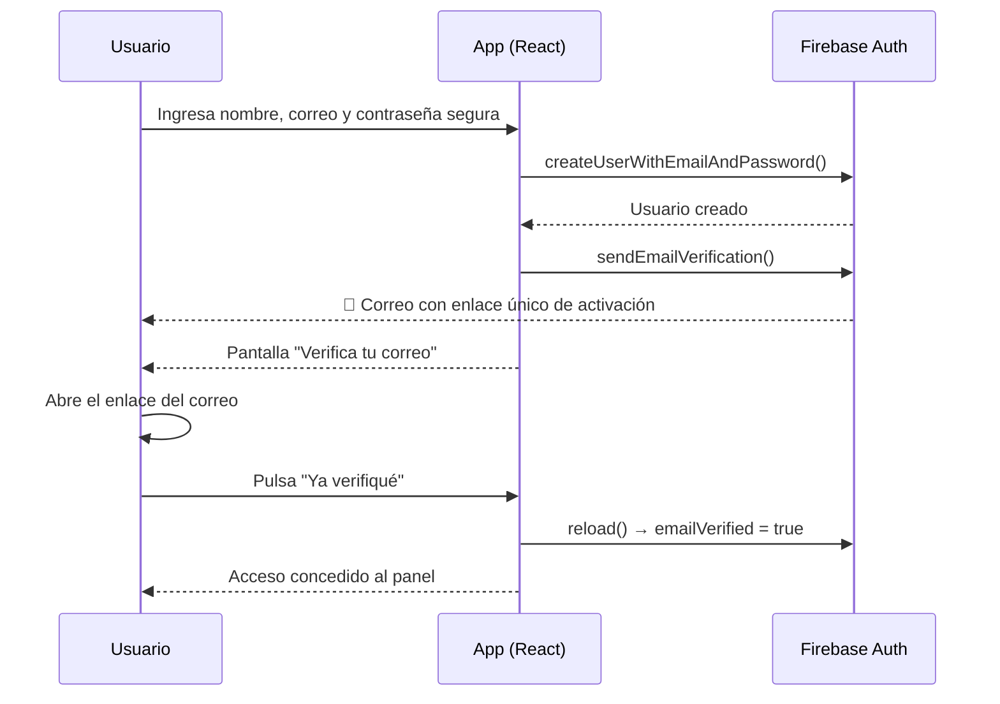
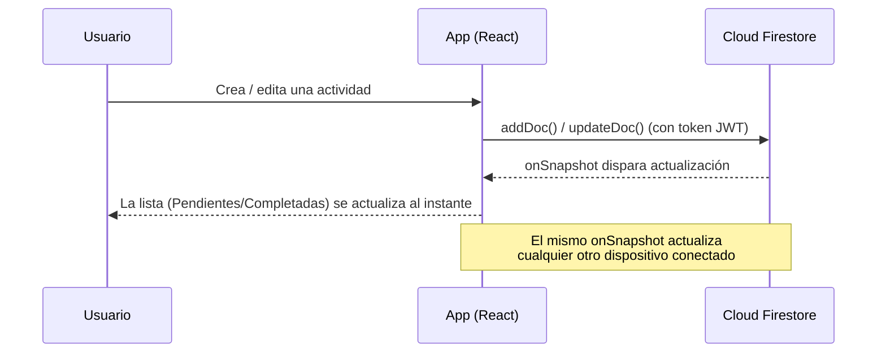
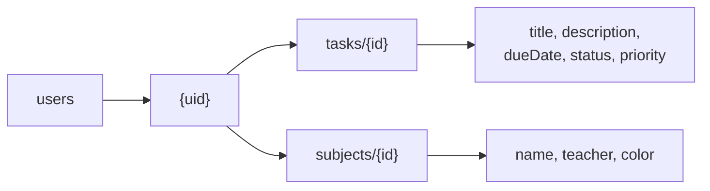

# Diagramas de flujo de datos — EduTrack

Los diagramas usan sintaxis **Mermaid** (se ven directamente en GitHub). También se
incluye una versión en imagen: [`diagrama-flujo.svg`](diagrama-flujo.svg).

---

## 1. Arquitectura general

---

## 2. Flujo de registro y verificación (RF01 + RF02)

---

## 3. Flujo de una actividad (CRUD + tiempo real — RF04/RF05)

---

## 4. Modelo de datos (Firestore)

